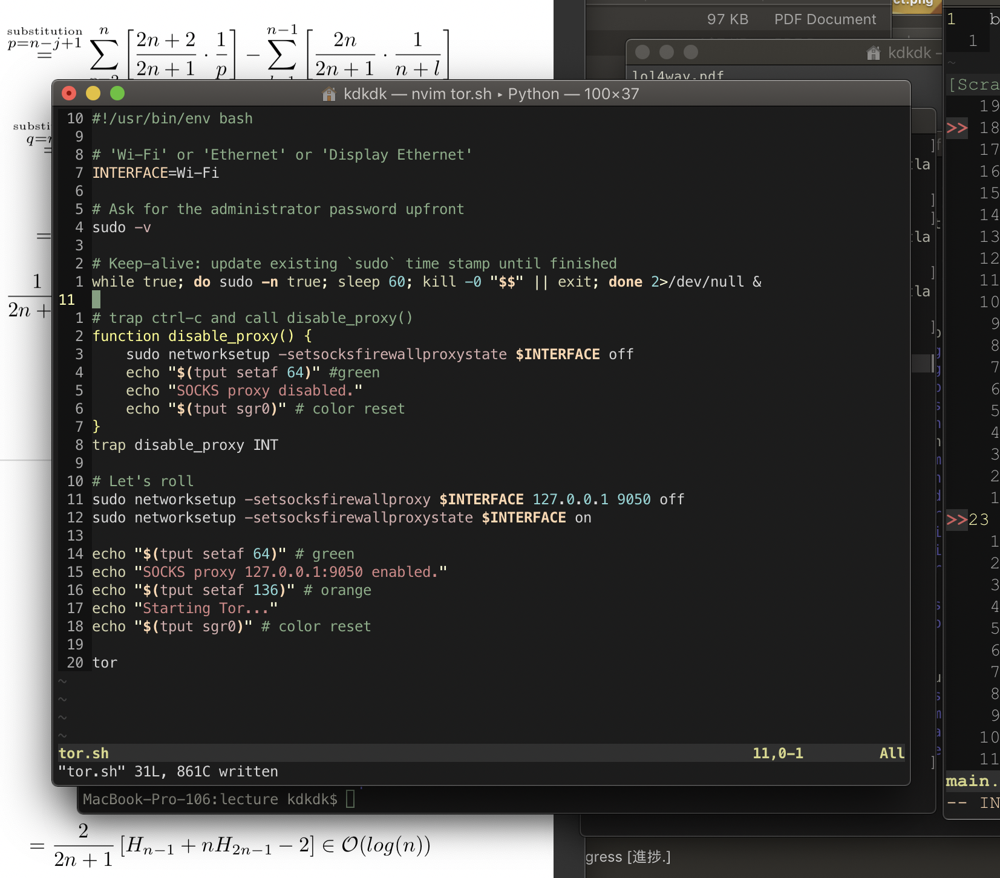
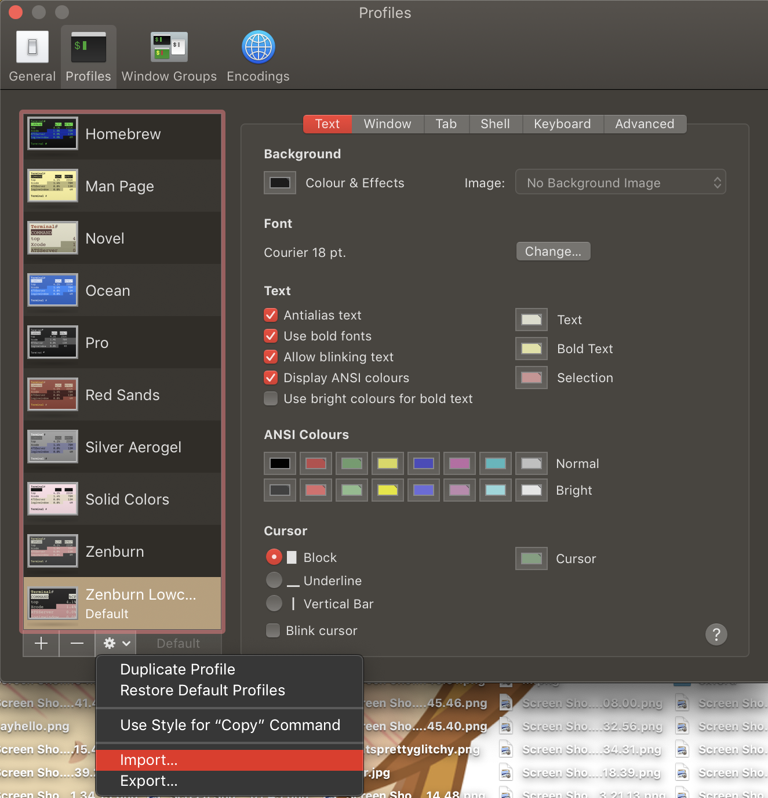

If you have other settings and don't want conflicts do the following:
Manually install by going to Settings>Profiles and click on to the preference symbol beside the +|- symbols. Then click Import and choose Zenburn_lowcontrast.terminal

Otherwise install.sh takes care of it for you.

